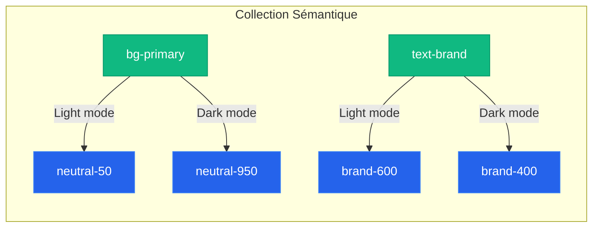

# Règle de Workspace : Système de Jetons de Couleur Sémantiques

Cette règle définit l'architecture de **couleurs sémantiques** (Alias) qui lie les **couleurs primitives** aux composants de l'application. Tout agent travaillant sur le style ou les couleurs de ce projet (React Native / NativeWind) doit impérativement respecter cette charte et ces variables.

---

## 🎨 Architecture des Jetons : Primitifs vs Sémantiques

Les variables sémantiques (deuxième collection Figma) ne doivent pas utiliser de valeurs hexadécimales brutes. Elles pointent vers les variables de la première collection (Primitives).



---

## 📋 Table de Correspondance des Variables Sémantiques

### 1. Arrière-plans (`bg/` / Backgrounds)
Utilisés pour les fonds d'écrans, de cartes, de boutons et de zones de saisie.

| Variable Figma | Liaison Mode Light | Liaison Mode Dark | Usage typique |
| :--- | :--- | :--- | :--- |
| `bg/canvas` | `neutral/50` | `neutral/950` | Fond principal de l'application (l'écran entier). |
| `bg/surface` | `neutral/0` (Blanc) | `neutral/900` | Éléments surélevés (cartes, boîtes de dialogue, modales). |
| `bg/surface-secondary` | `neutral/100` | `neutral/800` | Éléments secondaires (champs de recherche, entrées de texte). |
| `bg/brand` | `brand/600` | `brand/500` | Fond des boutons principaux ou éléments très forts de la marque. |
| `bg/brand-hover` | `brand/700` | `brand/400` | État survolé/pressé pour le fond de marque. |
| `bg/brand-subtle` | `brand/50` | `brand/950` | Badges, bannières légères de la marque. |
| `bg/disabled` | `neutral/200` | `neutral/800` | Fond pour les boutons ou éléments désactivés. |

---

### 2. Textes et Icônes (`text/` / Foreground)

| Variable Figma | Liaison Mode Light | Liaison Mode Dark | Usage typique |
| :--- | :--- | :--- | :--- |
| `text/primary` | `neutral/900` | `neutral/50` | Titres, texte principal, paragraphes importants. |
| `text/secondary` | `neutral/600` | `neutral/400` | Sous-titres, légendes, texte d'aide, placeholders. |
| `text/tertiary` | `neutral/400` | `neutral/600` | Textes très secondaires (ex: métadonnées, dates). |
| `text/brand` | `brand/600` | `brand/400` | Liens cliquables, titres accentués, états actifs. |
| `text/on-brand` | `neutral/0` (Blanc) | `neutral/950` | Texte écrit par-dessus un fond `bg/brand` (ex: bouton). |
| `text/disabled` | `neutral/400` | `neutral/600` | Texte sur un élément désactivé. |

---

### 3. Bordures et Séparateurs (`border/`)

| Variable Figma | Liaison Mode Light | Liaison Mode Dark | Usage typique |
| :--- | :--- | :--- | :--- |
| `border/default` | `neutral/200` | `neutral/800` | Lignes de séparation simples, bordures de cartes standard. |
| `border/strong` | `neutral/300` | `neutral/700` | Bordures de champs de texte (inputs) par défaut. |
| `border/focus` | `brand/500` | `brand/400` | Bordure d'un champ de texte actif/sélectionné. |
| `border/disabled` | `neutral/200` | `neutral/800` | Bordure d'un composant désactivé. |

---

### 4. États de Feedback (`status/` / Palette Organique Randonnée)

| Variable Figma | Liaison Mode Light | Liaison Mode Dark | Usage typique (Exemple randonnée) |
| :--- | :--- | :--- | :--- |
| **`status/bg-error`** | `red/600` (`#BC4749`) | `red/500` (`#E07A5F`) | Bouton d'action destructrice, icône de danger immédiat. |
| **`status/bg-error-subtle`** | `red/50` (`#FDF4F4`) | `red/950` (`#260B0C`) | Fond d'alerte : *"Sentier fermé pour cause d'éboulement"*. |
| **`status/text-error`** | `red/800` (`#6F2022`) | `red/200` (`#F3C6C6`) | Message d'erreur : *"Vous avez quitté l'itinéraire tracé"*. |
| **`status/bg-success`** | `green/600` (`#386641`) | `green/500` (`#6A994E`) | Indicateur : *"Itinéraire praticable"*. |
| **`status/bg-success-subtle`** | `green/50` (`#F2F6F3`) | `green/950` (`#0D1F11`) | Fond de toast : *"Randonnée terminée avec succès !"*. |
| **`status/text-success`** | `green/800` (`#1E3522`) | `green/200` (`#C8DBC5`) | Confirmation : *"Données cartographiques synchronisées"*. |
| **`status/bg-warning`** | `amber/600` (`#B07D06`) | `amber/500` (`#E9C46A`) | Icône d'avertissement : *"Niveau de batterie faible"*. |
| **`status/bg-warning-subtle`** | `amber/50` (`#FDFAF2`) | `amber/950` (`#241800`) | Fond d'alerte météo : *"Risque d'orages cet après-midi"*. |
| **`status/text-warning`** | `amber/800` (`#664600`) | `amber/200` (`#F4E2B0`) | Texte d'attention : *"Portion très glissante par temps humide"*. |
| **`status/bg-info`** | `blue/600` (`#457B9D`) | `blue/500` (`#98C1D9`) | Badge d'information : *"Refuge gardé à proximité"*. |
| **`status/bg-info-subtle`** | `blue/50` (`#F1F5F7`) | `blue/950` (`#0A192F`) | Fond d'astuce : *"Conseil : Remplissez vos gourdes à cette source"*. |
| **`status/text-info`** | `blue/800` (`#1D3557`) | `blue/200` (`#D0E1EC`) | Message informatif : *"Point d'eau potable dans 500m"*. |

---

## ⚡ Intégration NativeWind / React Native

### CSS Variables (`global.css`)
```css
@theme {
  --color-neutral-0: #ffffff;
  --color-neutral-50: #f8fafc;
  /* ... */
  --color-bg-canvas: var(--color-neutral-50);
  --color-text-primary: var(--color-neutral-900);
}

@media (prefers-color-scheme: dark) {
  :root {
    --color-bg-canvas: var(--color-neutral-950);
    --color-text-primary: var(--color-neutral-50);
  }
}
```

### Config (`tailwind.config.js`)
```javascript
module.exports = {
  theme: {
    extend: {
      colors: {
        bg: {
          canvas: 'var(--color-bg-canvas)',
          surface: 'var(--color-bg-surface)',
        },
        text: {
          primary: 'var(--color-text-primary)',
        }
      }
    }
  }
}
```

---

## 📝 Système de Jetons Typographiques (Typography Tokens)

Pour assurer une lisibilité parfaite des informations de randonnée (altitudes, distances, cartes) en extérieur, voici le système de typographie recommandé. Nous préconisons la police **Inter** (gratuite, open source et standard sur mobile pour une clarté absolue).

### 📋 Table des Styles de Texte Figma ↔️ Tailwind (NativeWind)

En utilisant des noms structurés avec des barres obliques `/` dans Figma (ex: `Display/Large`), vous générerez automatiquement des groupes très propres pour votre conception.

| Nom du style Figma | Taille (Size) | Interlignage (Line Height) | Graisse (Weight) | Équivalent Tailwind (Classes) | Usage typique |
| :--- | :--- | :--- | :--- | :--- | :--- |
| **`Display/Large`** | `36px` | `44px` (120%) | Medium (500) | `text-4xl font-medium tracking-tight` | Grandes statistiques (ex: altitude `2 450m`, `12.8 km`). |
| **`Display/Medium`** | `30px` | `38px` (125%) | Medium (500) | `text-3xl font-medium tracking-tight` | Chiffres intermédiaires, compte à rebours de marche. |
| **`Title/Page`** | `24px` | `32px` (130%) | Bold (700) | `text-2xl font-bold` | Titres d'écrans principaux (ex: "Mes Randonnées"). |
| **`Title/Section`** | `20px` | `28px` (140%) | Semi-Bold (600) | `text-xl font-semibold` | Titres de sections, titres de fiches ou cartes de rando. |
| **`Title/Subsection`**| `18px` | `26px` (140%) | Semi-Bold (600) | `text-lg font-semibold` | Sous-catégories, questions de formulaires. |
| **`Body/Large`** | `16px` | `24px` (150%) | Regular (400) | `text-base font-normal` | Descriptions détaillées d'itinéraires, articles. |
| **`Body/Medium`** | `14px` | `20px` (140%) | Regular (400) | `text-sm font-normal` | **Le texte par défaut** de l'app (fiches techniques, avis). |
| **`Body/Small`** | `11px` | `14px` (125%) | Regular (400) | `text-[11px] leading-[14px] font-normal` | Métadonnées de fiches (ex: *"Difficulté • 4h30"*). |
| **`Body/Small-Bold`**| `11px` | `14px` (125%) | Bold (700) | `text-[11px] leading-[14px] font-bold` | Titres de métadonnées, scores (ex: *"**4.8** (120 avis)"*). |
| **`Button/Default`** | `16px` | `24px` (150%) | Semi-Bold (600) | `text-base font-semibold` | Texte dans les boutons principaux de 48px de hauteur. |
| **`Button/Small`** | `14px` | `20px` (140%) | Semi-Bold (600) | `text-sm font-semibold` | Texte pour les filtres et petits boutons de 36px. |

---

### 💡 Recommandations ergonomiques pour la randonnée :
1. **Ne descendez jamais sous les 12px** : En extérieur, avec les reflets du soleil sur l'écran et le mouvement de la marche, les textes de moins de 12px deviennent illisibles.
2. **Ne négligez pas l'interlignage (Line Height)** : Un interlignage trop serré rend la lecture fatigante. En code, utilisez toujours les classes correspondantes comme `leading-relaxed` ou spécifiez-les en hauteur fixe (ex: `h-12` pour les conteneurs).
3. **Le contraste est roi** : Associez toujours vos styles typographiques à vos variables de contraste (ex: `text-text-primary` pour les titres et `text-text-secondary` pour le corps de texte).

