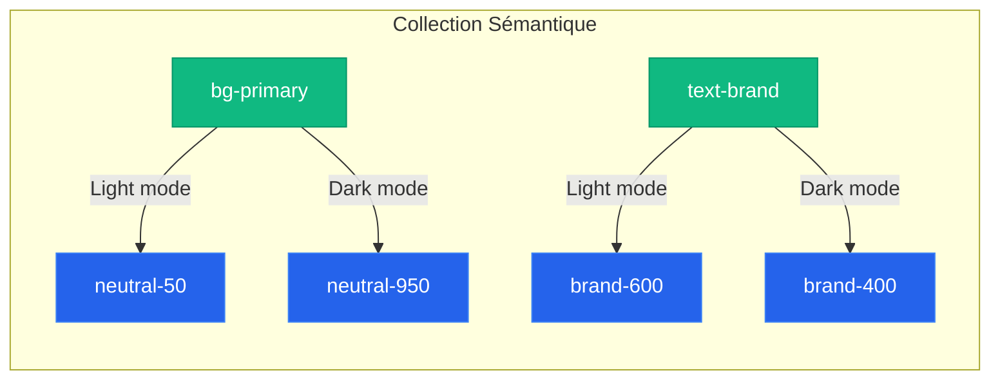

# Système de Jetons de Couleur Sémantiques (Design Tokens)

Ce guide définit une architecture de **couleurs sémantiques** (Alias) qui fait le pont entre vos **couleurs primitives** (ex: `neutral-50`, `brand-600`) et vos composants d'interface, optimisée pour **Figma Variables** et parfaitement compatible avec **NativeWind** / **React Native**.

---

## 🎨 Architecture des Jetons : Primitifs vs Sémantiques

Dans Figma, vous avez déjà configuré votre première collection (Primitives). La deuxième collection (Sémantique) ne doit **jamais** utiliser de valeurs hexadécimales directes. Elle doit **pointer (lier)** vers les variables de la première collection.



---

## 📋 Table de Correspondance des Variables Sémantiques

Voici la liste recommandée des variables sémantiques à créer dans votre deuxième collection Figma, avec des suggestions de liaisons (mapping) pour les modes **Light** et **Dark**.

### 1. Arrière-plans (`bg-` / Backgrounds)
Utilisés pour les fonds d'écrans, de cartes, de boutons et de zones de saisie.

| Variable Figma | Liaison Mode Light | Liaison Mode Dark | Usage typique |
| :--- | :--- | :--- | :--- |
| `bg-canvas` | `neutral-50` | `neutral-950` | Fond principal de l'application (l'écran entier). |
| `bg-surface` | `neutral-0` (Blanc) | `neutral-900` | Éléments surélevés (cartes, boîtes de dialogue, modales). |
| `bg-surface-secondary` | `neutral-100` | `neutral-800` | Éléments secondaires (champs de recherche, entrées de texte). |
| `bg-brand` | `brand-600` | `brand-500` | Fond des boutons principaux ou éléments très forts de la marque. |
| `bg-brand-hover` | `brand-700` | `brand-400` | État survolé/pressé pour le fond de marque. |
| `bg-brand-subtle` | `brand-50` | `brand-950` | Badges, bannières légères de la marque. |
| `bg-disabled` | `neutral-200` | `neutral-800` | Fond pour les boutons ou éléments désactivés. |

---

### 2. Textes et Icônes (`text-` / Foreground)
En React Native / NativeWind, les icônes vectorielles et les textes partagent généralement les mêmes variables de couleur pour assurer la cohérence visuelle.

| Variable Figma | Liaison Mode Light | Liaison Mode Dark | Usage typique |
| :--- | :--- | :--- | :--- |
| `text-primary` | `neutral-900` | `neutral-50` | Titres, texte principal, paragraphes importants. |
| `text-secondary` | `neutral-600` | `neutral-400` | Sous-titres, légendes, texte d'aide, placeholders. |
| `text-tertiary` | `neutral-400` | `neutral-600` | Textes très secondaires (ex: métadonnées, dates). |
| `text-brand` | `brand-600` | `brand-400` | Liens cliquables, titres accentués, états actifs. |
| `text-on-brand` | `neutral-0` (Blanc) | `neutral-950` | Texte écrit par-dessus un fond `bg-brand` (ex: texte d'un bouton). |
| `text-disabled` | `neutral-400` | `neutral-600` | Texte sur un élément désactivé. |

---

### 3. Bordures et Séparateurs (`border-`)
Pour structurer visuellement vos layouts sans surcharger l'interface.

| Variable Figma | Liaison Mode Light | Liaison Mode Dark | Usage typique |
| :--- | :--- | :--- | :--- |
| `border-default` | `neutral-200` | `neutral-800` | Lignes de séparation simples, bordures de cartes standard. |
| `border-strong` | `neutral-300` | `neutral-700` | Bordures de champs de texte (inputs) par défaut. |
| `border-focus` | `brand-500` | `brand-400` | Bordure d'un champ de texte actif/sélectionné. |
| `border-disabled` | `neutral-200` | `neutral-800` | Bordure d'un composant désactivé. |

---

### 4. États de Feedback (`status-` / Randonnée Palette)
Tons doux, calmes et organiques, optimisés pour une application de randonnée (vert sapin, ocre terreux, brique terracotta, bleu lac).

| Variable Figma | Liaison Mode Light | Liaison Mode Dark | Usage typique (Exemple randonnée) |
| :--- | :--- | :--- | :--- |
| **`status/bg-error`** | `red-600` (`#BC4749`) | `red-500` (`#E07A5F`) | Bouton d'action destructrice, icône de danger immédiat. |
| **`status/bg-error-subtle`** | `red-50` (`#FDF4F4`) | `red-950` (`#260B0C`) | Fond d'alerte : *"Sentier fermé pour cause d'éboulement"*. |
| **`status/text-error`** | `red-800` (`#6F2022`) | `red-200` (`#F3C6C6`) | Message d'erreur : *"Vous avez quitté l'itinéraire tracé"*. |
| **`status/bg-success`** | `green-600` (`#386641`) | `green-500` (`#6A994E`) | Indicateur : *"Itinéraire praticable"*. |
| **`status/bg-success-subtle`** | `green-50` (`#F2F6F3`) | `green-950` (`#0D1F11`) | Fond de toast : *"Randonnée terminée avec succès !"*. |
| **`status/text-success`** | `green-800` (`#1E3522`) | `green-200` (`#C8DBC5`) | Confirmation : *"Données cartographiques synchronisées"*. |
| **`status/bg-warning`** | `amber-600` (`#B07D06`) | `amber-500` (`#E9C46A`) | Icône d'avertissement : *"Niveau de batterie faible"*. |
| **`status/bg-warning-subtle`** | `amber-50` (`#FDFAF2`) | `amber-950` (`#241800`) | Fond d'alerte météo : *"Risque d'orages cet après-midi"*. |
| **`status/text-warning`** | `amber-800` (`#664600`) | `amber-200` (`#F4E2B0`) | Texte d'attention : *"Portion très glissante par temps humide"*. |
| **`status/bg-info`** | `blue-600` (`#457B9D`) | `blue-500` (`#98C1D9`) | Badge d'information : *"Refuge gardé à proximité"*. |
| **`status/bg-info-subtle`** | `blue-50` (`#F1F5F7`) | `blue-950` (`#0A192F`) | Fond d'astuce : *"Conseil : Remplissez vos gourdes à cette source"*. |
| **`status/text-info`** | `blue-800` (`#1D3557`) | `blue-200` (`#D0E1EC`) | Message informatif : *"Point d'eau potable dans 500m"*. |

---

## ⚡ Intégration NativeWind / React Native

Pour que vos classes sémantiques comme `bg-canvas`, `text-primary` ou `border-focus` fonctionnent de manière transparente avec NativeWind en supportant le mode sombre (`dark:`), voici la configuration standard à adopter.

### Étape 1 : Export CSS (pour NativeWind v4 ou Tailwind CSS)
Générez ou écrivez vos variables CSS dans votre fichier global (souvent `global.css` ou `styles.css`) :

```css
@theme {
  /* Primitives (Optionnel, utile si vous voulez y accéder directement) */
  --color-neutral-0: #ffffff;
  --color-neutral-50: #f8fafc;
  --color-neutral-100: #f1f5f9;
  /* ... rest of primitives */

  /* Sémantiques - Mode Light (Valeurs par défaut) */
  --color-bg-canvas: var(--color-neutral-50);
  --color-bg-surface: var(--color-neutral-0);
  --color-bg-surface-secondary: var(--color-neutral-100);
  --color-bg-brand: var(--color-brand-600);
  --color-bg-disabled: var(--color-neutral-200);

  --color-text-primary: var(--color-neutral-900);
  --color-text-secondary: var(--color-neutral-600);
  --color-text-brand: var(--color-brand-600);
  --color-text-on-brand: var(--color-neutral-0);

  --color-border-default: var(--color-neutral-200);
  --color-border-strong: var(--color-neutral-300);
  --color-border-focus: var(--color-brand-500);
}

@media (prefers-color-scheme: dark) {
  :root {
    /* Sémantiques - Mode Dark */
    --color-bg-canvas: var(--color-neutral-950);
    --color-bg-surface: var(--color-neutral-900);
    --color-bg-surface-secondary: var(--color-neutral-800);
    --color-bg-brand: var(--color-brand-500);
    --color-bg-disabled: var(--color-neutral-800);

    --color-text-primary: var(--color-neutral-50);
    --color-text-secondary: var(--color-neutral-400);
    --color-text-brand: var(--color-brand-400);
    --color-text-on-brand: var(--color-neutral-950);

    --color-border-default: var(--color-neutral-800);
    --color-border-strong: var(--color-neutral-700);
    --color-border-focus: var(--color-brand-400);
  }
}
```

### Étape 2 : Configuration Tailwind / NativeWind (`tailwind.config.js`)
Si vous utilisez NativeWind v2 ou v3 avec une structure standard de configuration Tailwind, configurez votre thème de cette façon pour lier vos jetons sémantiques :

```javascript
// tailwind.config.js
module.exports = {
  content: ["./app/**/*.{js,jsx,ts,tsx}", "./components/**/*.{js,jsx,ts,tsx}"],
  theme: {
    extend: {
      colors: {
        // Jetons Sémantiques d'Arrière-plan
        bg: {
          canvas: 'var(--color-bg-canvas)',
          surface: 'var(--color-bg-surface)',
          'surface-secondary': 'var(--color-bg-surface-secondary)',
          brand: 'var(--color-bg-brand)',
          'brand-subtle': 'var(--color-bg-brand-subtle)',
          disabled: 'var(--color-bg-disabled)',
        },
        // Jetons Sémantiques de Texte
        text: {
          primary: 'var(--color-text-primary)',
          secondary: 'var(--color-text-secondary)',
          tertiary: 'var(--color-text-tertiary)',
          brand: 'var(--color-text-brand)',
          'on-brand': 'var(--color-text-on-brand)',
          disabled: 'var(--color-text-disabled)',
        },
        // Jetons Sémantiques de Bordure
        border: {
          default: 'var(--color-border-default)',
          strong: 'var(--color-border-strong)',
          focus: 'var(--color-border-focus)',
          disabled: 'var(--color-border-disabled)',
        },
        // Feedback
        error: {
          DEFAULT: 'var(--color-bg-error)',
          subtle: 'var(--color-bg-error-subtle)',
          text: 'var(--color-text-error)',
        },
        success: {
          subtle: 'var(--color-bg-success-subtle)',
          text: 'var(--color-text-success)',
        },
      },
    },
  },
  plugins: [],
}
```

---

## 💡 Astuces Figma pour NativeWind

1. **Nommage avec des barres obliques `/` dans Figma** : 
   Dans votre collection Figma sémantique, utilisez des noms structurés avec des slashs comme `bg/canvas`, `bg/surface`, `text/primary` etc. Figma va automatiquement créer des sous-groupes visuels très agréables à lire, et cela correspond parfaitement à la syntaxe d'objet de Tailwind (ex: `bg.canvas` dans la config Tailwind = classe `bg-bg-canvas` ou simplement configurée de manière plate pour obtenir des classes élégantes comme `bg-canvas`, `text-primary`, `border-strong`).
2. **Utilisation dans React Native** :
   Grâce à NativeWind, vous pourrez écrire du code extrêmement propre et adaptatif :
   ```tsx
   <View className="bg-canvas border-b border-default p-4">
     <Text className="text-primary font-bold text-lg">Mon Titre</Text>
     <Text className="text-secondary text-sm">Mon sous-titre de carte</Text>
     
     <TouchableOpacity className="bg-brand rounded-lg p-3 mt-4">
       <Text className="text-on-brand text-center font-medium">Bouton Principal</Text>
     </TouchableOpacity>
   </View>
   ```
   Ce composant changera **automatiquement** de couleurs entre les modes sombre et clair sans avoir besoin d'écrire de logique JS manuelle (`useColorScheme`) pour chaque couleur !

---

## 📝 Système de Jetons Typographiques (Typography Tokens)

Pour assurer une lisibilité parfaite des informations de randonnée (altitudes, distances, cartes) en extérieur, voici le système de typographie recommandé. Nous préconisons la police **Inter** (gratuite, open source et standard sur mobile pour une clarté absolue).

### 📋 Table des Styles de Texte Figma ↔️ Tailwind (NativeWind)

En utilisant des noms structurés avec des barres obliques `/` dans Figma (ex: `Display/Large`), vous générerez automatiquement des groupes très propres pour votre conception.

| Nom du style Figma | Taille (Size) | Interlignage (Line Height) | Graisse (Weight) | Équivalent Tailwind (Classes) | Usage typique |
| :--- | :--- | :--- | :--- | :--- | :--- |
| **`Display/Large`** | `36px` | `44px` (120%) | Medium (500) | `text-4xl font-medium tracking-tight` | Grandes statistiques (ex: altitude `2 450m`, `12.8 km`). |
| **`Display/Medium`** | `30px` | `38px` (125%) | Medium (500) | `text-3xl font-medium tracking-tight` | Chiffres intermédiaires, compte à rebours de marche. |
| **`Title/Page`** | `24px` | `32px` (130%) | Bold (700) | `text-2xl font-bold` | Titres d'écrans principaux (ex: "Mes Randonnées"). |
| **`Title/Section`** | `20px` | `28px` (140%) | Semi-Bold (600) | `text-xl font-semibold` | Titres de sections, titres de fiches ou cartes de rando. |
| **`Title/Subsection`**| `18px` | `26px` (140%) | Semi-Bold (600) | `text-lg font-semibold` | Sous-catégories, questions de formulaires. |
| **`Body/Large`** | `16px` | `24px` (150%) | Regular (400) | `text-base font-normal` | Descriptions détaillées d'itinéraires, articles. |
| **`Body/Medium`** | `14px` | `20px` (140%) | Regular (400) | `text-sm font-normal` | **Le texte par défaut** de l'app (fiches techniques, avis). |
| **`Body/Small`** | `11px` | `14px` (125%) | Regular (400) | `text-[11px] leading-[14px] font-normal` | Métadonnées de fiches (ex: *"Difficulté • 4h30"*). |
| **`Body/Small-Bold`**| `11px` | `14px` (125%) | Bold (700) | `text-[11px] leading-[14px] font-bold` | Titres de métadonnées, scores (ex: *"**4.8** (120 avis)"*). |
| **`Button/Default`** | `16px` | `24px` (150%) | Semi-Bold (600) | `text-base font-semibold` | Texte dans les boutons principaux de 48px de hauteur. |
| **`Button/Small`** | `14px` | `20px` (140%) | Semi-Bold (600) | `text-sm font-semibold` | Texte pour les filtres et petits boutons de 36px. |

---

### 💡 Recommandations ergonomiques pour la randonnée :
1. **Ne descendez jamais sous les 12px** : En extérieur, avec les reflets du soleil sur l'écran et le mouvement de la marche, les textes de moins de 12px deviennent illisibles.
2. **Ne négligez pas l'interlignage (Line Height)** : Un interlignage trop serré rend la lecture fatigante. En code, utilisez toujours les classes correspondantes comme `leading-relaxed` ou spécifiez-les en hauteur fixe (ex: `h-12` pour les conteneurs).
3. **Le contraste est roi** : Associez toujours vos styles typographiques à vos variables de contraste (ex: `text-text-primary` pour les titres et `text-text-secondary` pour le corps de texte).

